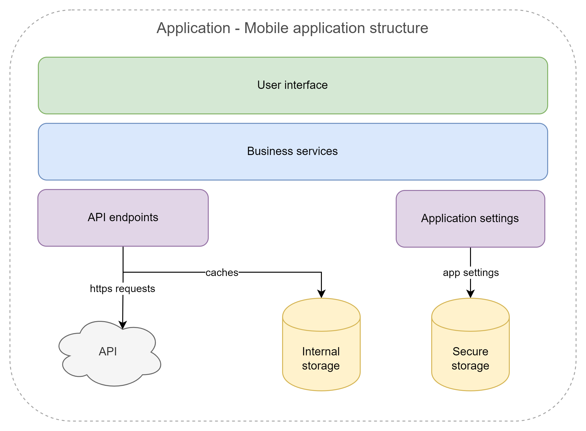
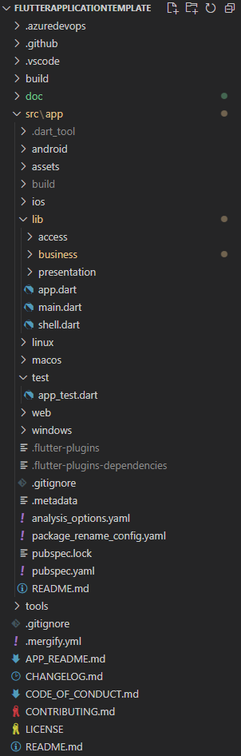

# Software Architecture

## Context

_[Insert context description here]_

_[Create this diagram from the [architecture file](diagrams/architecture.drawio) (context tab) using [Draw.io](https://www.draw.io/)]_

## Functional Overview

This is a summary of the functionalities available to the user.

_[Insert list of functionalities here]_

## Application Structure

_[Insert structure description here]_

_[Create this diagram from the [architecture file](diagrams/architecture.drawio) (structure tab) using [Draw.io](https://www.draw.io/)]_

## Solution Structure

The application solution is divided in 2 main areas.

- `test` contains the tests.
- `lib` contains the shared code used by the application and the tests.
  - It's divided per application layer.

### Access (DAL)

The _data access layer_ is where you would put external dependencies such as API clients and local storage.
Classes providing data should be suffixed with `Repository`.
This is where you put serializable entities.
The associated folder is named `access` (and not `data_access`) so that it shows as the first element alphabetically.

### Business

The business layer is where you put your business services and entities that manipulate data from the data access layer.
Classes providing business services should be suffixed with `Service`.
Entities from the business layer are usually immutable and they don't need to be serializable.

### Presentation

The presentation layer implements the user experience (UX) and the user interface (UI).
It contains all the widgets and state management classes.

# Technical Overview

## General

Topics that apply to the whole application.

### Dependency Injection

This application is designed to use dependency injection (DI) to manage dependencies between components.

See [DependencyInjection.md](DependencyInjection.md) for more details.

## Access (DAL)

Data access services (also referred to as _repositories_) are always declared using an interface and implemented in a separate class. These interfaces are meant to be used from the business layer.

### HTTP Requests

See [HTTP.md](HTTP.md) for more details.

### Local Storage

This applications uses [Shared Preferences](https://pub.dev/packages/shared_preferences) to store data locally.

### JSON Serialization

See [Serialization.md](Serialization.md) for more details.

## Business

Business services are always declared using an interface and implemented in a separate class. These interfaces are meant to be used from the presentation layer and sometimes by other business services.

## Presentation

### Navigation

See [Navigation.md](Navigation.md) for more details.

### State Management

This application uses [Riverpod](https://pub.dev/packages/riverpod) to implement the MVVM pattern. The `ViewModel` class is used as a base class for all ViewModels.

### UI Framework

This applications uses [Flutter](https://flutter.dev/) as the UI framework.

### Design System

This application uses resources from Material Design.
